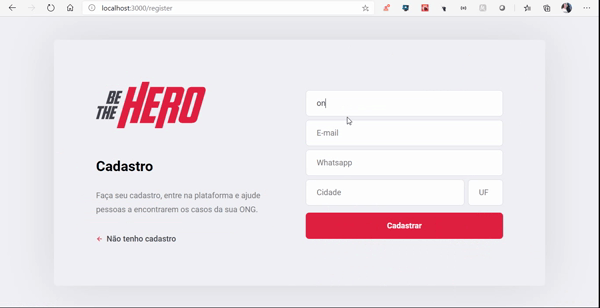
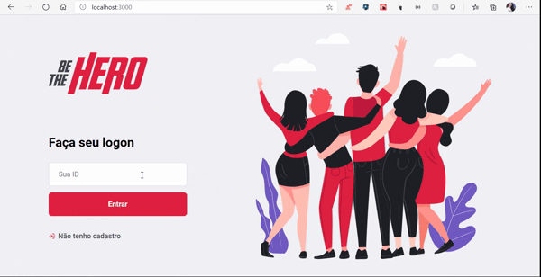
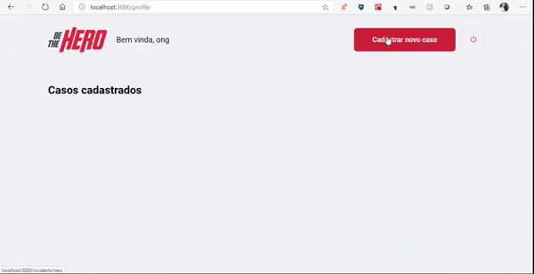

<h1 align="center">
 
  
 
 
Be The Hero
</h1>

Aplicativo que permite tornar pessoas em heróis através da ajuda à causas nobres. 

  
  
  

## Tecnologias Utilizadas
[//]: # (Add the features of your project here:)
Essa aplicação utiliza ferramentas e práticas atualizadas na criação de aplicações web e mobile.

- ⚛️ **React Js** — Uma biblioteca javascript para a construção de interfaces.
- ⚛️ **React Native** — Uma biblioteca que viabiliza a criação de aplicativos nativos para Android e IOS.
- 💹 **Node Js** — Uma framework web para a construção de API's.

## Iniciando o Projeto
1. Clonar o repositório utilizando o comando git clone https://github.com/RosaAmanda/Be-The-Hero.git
2. Navegar para a pasta Be-The-Hero

## Iniciando o Back-End
1. Navegar para a pasta backend: cd backend
2. Executar npm install para instalar as dependências
3. Executar npm start para iniciar a aplicação backend

## Iniciando o Front-End
1. Navegar para a pasta frontend: cd frontend
2. Executar yarn para instalar as dependências
3. Executar yarn start para iniciar a aplicação frontend

## Iniciando o Aplicativo Mobile
1. Navegar para a pasta mobile: cd mobile
2. Executar yarn para instalar as dependências
3. Executar npm react-native run-android para iniciar a aplicação mobile

Nota: Se você escolher iniciar a aplicação mobile no emulador Android, é necessário iniciar o emulador antes de executar o comando run-android.
